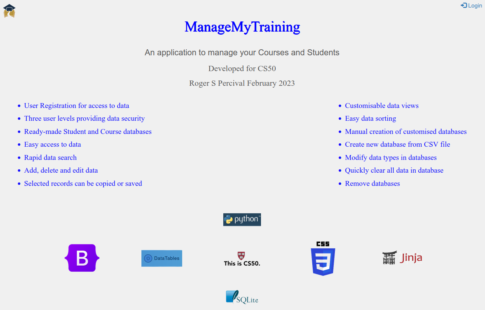
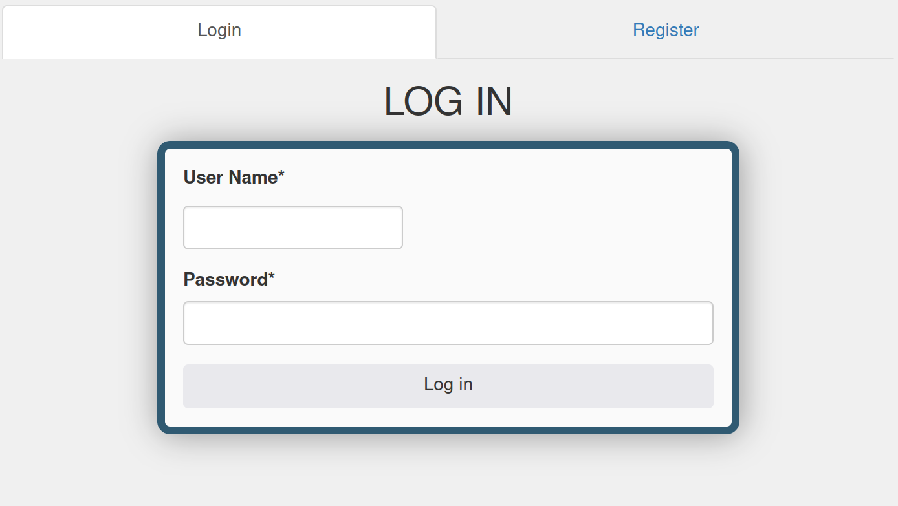
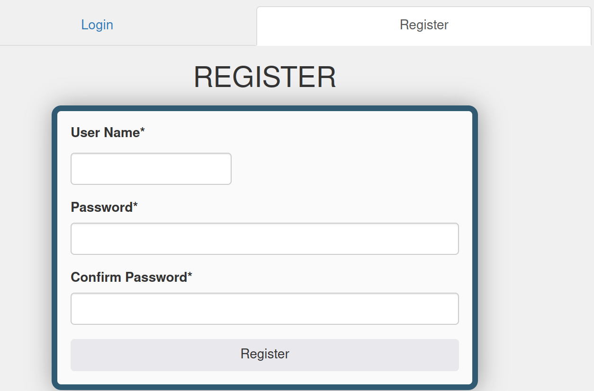
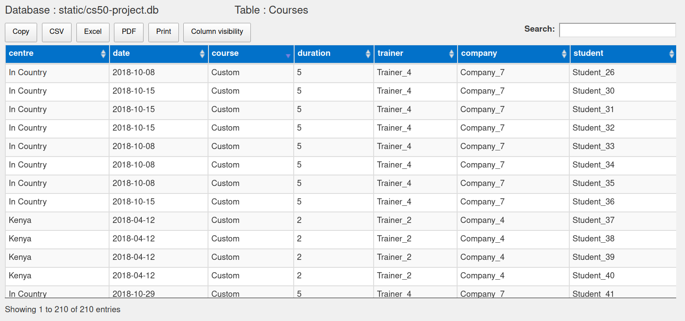
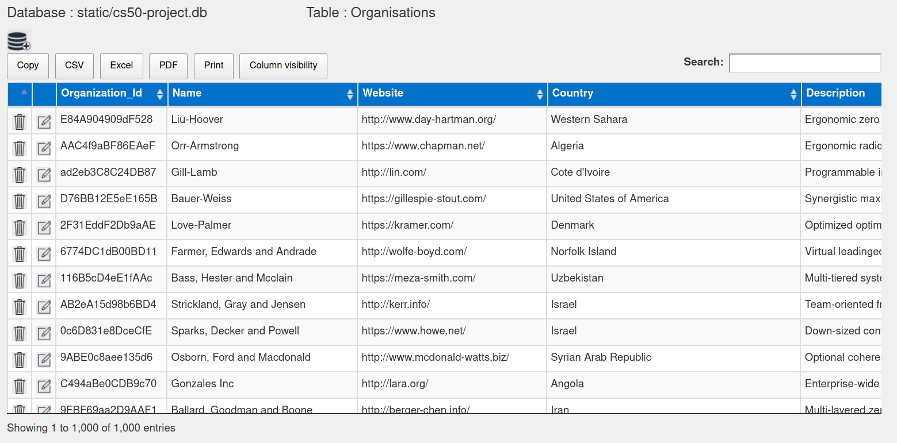

# TrackMyTraining
#### Video Demo:  <URL HERE>
#### Description: see below

## CS50 Final project by - Roger S. Percival February 2023

### Rationale for this project

Whilst managing all global training for my recent Company, it was necessary to keep records of scheduled courses and attendees.
These details were held in an Excel workbook (inherited) but this was found to be impractical, especially in relation to permissions.
I ultimately imported the data (using phpMyAdmin) into an SQL database with two tables, Students and Courses being created.
Customers frequently requested information about who attended which course and when, along with post-course exam results.
A small amount of PHP code was written to facilitate obtaining this information.

Now that I have gained more knowledge from the CS50 course, I have vastly improved upon my original implementation by using 
[Python](https://www.python.org/) and [Jinja](https://jinja.palletsprojects.com/en/3.1.x/).

As development progressed, I decided to add the capability to add more tables and modify their structure

#### Additional information

Throughout development of this application, online resource was extensively used, including -
- stackoverfow

### Project Features

- Potential users MUST be registered before being allowed any access
- Three user levels available
	- 1 : Only permitted access to Student and Course data (table changes not possible)
   - 2 : Access to all tables with capability to add/delete records
   - 3 : Full access to entire database
- All tables can be easily accessed
- Case-insensitive search of displayed table available
- Multiple fields can be selected from table view to be saved (standard mouse-clicks)
- Displayed table fields can be removed from display
- Displayed table fields can be re-ordered and sorted
- Tables can be created from CSV files
- Tables can be created manually
- Records can be editted/updated
- Records can be added and deleted from any table
- Fields can be added and deleted from any table
- Table data can be cleared
- Tables can be deleted from the database

### External Python Modules

- cs50
- csv
- flask
- flask_session
- glob
- pandas
- sqlite3
- werkzeug.security

### Summary of Python Functions

#### addfield
- Creates a pandas dataframe ('*df*') from the selected table and modifies it by adding new 
Column name and an appropriate value (TEXT - "None", INTEGER - 0 , REAL - 0.0). A call is made to '*writeDF_to_SQL*' 
to write the dataframe to the database
- Returns 'render_template' with '*table.html*'

#### addrecord
- Adds a new record to the currently selected table
- Calls '*createSQLColumnStr*' and '*createSQLValueStr*' to be used in SQL **INSERT** instruction
- Note that if the selected table is 'Users' a record cannot be added - Use 'Register to add a new user
- Returns 'render_template' with '*table.html*'

#### cleartable
- Clears all records from the currently selected table
- Note that if the selected table is 'Users' this function is disabled

#### create_connection
- Creates a connection to the database (cs50-project.db)
- Returns **conn**

#### createDF_from_csv
- Creates a pandas dataframe from the chosen CSV file. All CSV files are stored in the directory '**/static/csv**'.
It should be noted that if an indexing column is present in the CSV file, it will need to be removed before import, otherwise an exception will occur.
During the import, the pandas module will attempt to identify the datatype for each column. 
Once the import has been completed, a new table with the specified name will be stored in the database, along with imported data
- Returns *df*
 
#### createDF_from_table_fields
- Creates a pandas dataframe from the columns in the selected table which can then later be used to either add or drop a column from the database table
- Returns *df*

#### createDF_from_table
- Creates a pandas dataframe from the selected table which can then later be used to either add, edit or delete a record from the table
- Returns *df*

#### createDFTypes
- Constructs a dictionary from the column names and types of the provided table. 
  This is **essential** to ensue that the appropriate datatypes (*by default the datatype is text*) will be written back to the database
- Returns *dtypedict* 

#### createSQLColumnStr
- Creates the 'Column part' of an SQLQuery when adding a new record using INSERT
- *SQLQuery = 'INSERT INTO '+ tablename + **SQLColumnStr** + ' VALUES' + SQLValueStr* 
- Returns *SQLColumnStr*

#### createSQLUpdateStr
- Creates the SQLQuery when updating an record using UPDATE. 
Note that idx points to the record to be updated following an edit
- *SQLQuery = 'UPDATE '+ tablename + ' SET ' + **SQLUpdateStr** + ' WHERE "idx" = ' + str(idx)*
- Returns *SQLUpdateStr*

#### createSQLValueStr
- Creates the 'Value part' of an SQLQuery when adding a new record using INSERT
- *SQLQuery = 'INSERT INTO '+ tablename + SQLColumnStr + ' VALUES' + **SQLValueStr***
- Returns *SQLValueStr*

#### createtable
- GET : Displays page for user to enter new table name and number of fields
- POST : Creates a pandas dataframe, processes the html code for '*table.html*' and uses SQL SELECT to populate displayed table
- Returns 'render_template' with '*create-table-1.html*' with GET method
- Returns 'render_template' with '*create-table-2*' with POST method
- Note : Replaces 'spaces' and '-' with '_' in supplied table name

#### deletefield
- Creates a pandas dataframe ('*df*') from selected table, drop the appropriate column (referenced by '*idx*') and call '*writeDF_to_SQL*' to write modified dataframe back to the database
- Note that if the selected table is 'Users' the 'admin' user cannot be deleted

#### deleterecord
- Deletes the currently selected record using SQLQuery '**DELETE**' to update the database
- Note : If the selected table is 'Users' the 'admin' user cannot be deleted

#### deletetable
- Deletes the currently selected table from the database
- Note : If the selected table is 'Users' this function is disabled

#### editrecord
- Edits an existing record in a table and update the database
- Returns 'render_template' with '*table.html*'
- Note that if the selected table is 'Users' only the level can be changed (1-3)

#### generate_table
- Creates a pandas data frame from the selected table which is then used to dynamically create **table.html**
by calling *process_dataframe*. 
An SQL SELECT query is then used to get all relevant records from the database which will be used to populate (when displayed) **table.html**
- Returns *records*

#### getColumnNames
- Creates a pandas dataframe (df) of the specified table and creates a list of column names using *df.columns*
- Returns *columnNames*

#### getColumnTypes
- Uses SQLite *PRAGMA* to get the column types of the specified table which are then added to a list
- Returns *columnTypes*

#### getfields
- Uses SQLite *PRAGMA* to get the column types of the specified table to be used with '*addrecord*'
- Returns 'render_template' with '*addrecord.html*'

#### getfields2
- Specifies 3 datatypes to be used when new column will be created from '*addcolumn.html*' 
- Returns 'render_template' with '*addcolumn.html*'
 
#### getfields3
- Gets column names and values for record referenced by'*idx*' from specified table in database 
with results to be displayed in '*editrecord.html*'
- Returns 'render_template' with '*editrecord.html*'

#### getLayout
- Determines which layout will be used based upon level of logged in user
- Returns *level*
- Note : 3 layouts;  layout-2.html (level 1 user), layout-3.html (level 2 user), layout-4.html (level 3 user)
	
#### getLevel
- Queries database to obtain level of current user based on *session['user_id']*
- Returns *level*
	- level 1, can only view Student and Course tables
	- level 2, can access all tables and can add, edit and delete records
	- level 3, full access to database, can create, import (from CSV files), edit and delete tables

#### getUserName
- Queries database to obtain user name of current user based on *session['user_id']*
- Returns *username*

#### home
- Home page, **index.html**.

#### importCSV
- GET : Gets a list of available CSV files (stored in '*static/csv*')
- POST : Creates a pandas dataframe (*df*) by calling *createDF_from_csv*, then calls *writeDF_to_SQL2* to write the dataframe to the database.
A call to *generate_table* then generates the appropriate html code for table.html
- Returns 'render_template' with '*getcsvfile.html*' with GET method
- Returns 'render_template' with '*table.html*' with POST method

#### listfields
- GET : Gets a list of available tables
- POST : Creates a pandas dataframe, processes the html code for '*table.html*' and uses SQL SELECT to populate displayed table
- Returns 'render_template' with '*column-list-1.html*' with GET method
- Returns 'render_template' with '*table.html*' with POST method

#### listtables
- GET : Gets a list of available tables
- POST : Creates a pandas dataframe, processes the html code for '*table.html*' and uses SQL SELECT to populate displayed table
- Returns 'render_template' with either '*table-list-1.html*' (level 2) or '*table-list-2.html*' (level 3) with GET method
- Returns 'render_template' with '*column-list-2.html*' with POST method

#### login
- Validates user name/password and ensures user has been registered
- Returns 'render_template' with *layout-'X'.html*, based on user level (X = user level + 1) 

#### logout
- Clears session
- Returns 'render_template' with *login.html*

#### maketable
- POST : Gets table name, number of fields and field names from user. 
An SQL query string is constructed from this information and a new table is created if it doesn't already exist
- Returns 'render_template' with *create-table-2.html* with GET method
- Returns 'render_template' with *table.html* with POST method
- NOTE : This function does **NOT** create a unique index so a pandas datframe is create from the table and 
rewritten to the database with unique indeces

#### process_dataframe
- Dynamically creates the html code for *table.html* (different for each table)
- A pandas dataframe (df) and tablename are used as inputs for creation

#### register
- This function receives username, password and password confirmation from user.
These are validated and if the user is not already registered a hash of the password will be generated. 
A pandas dataframe is generated, the new user is added (with a default of level 1) and the dataframe is written back to the database.
- Returns 'render_template' with *login.html* 

#### showcourses
- Displays the pre-defined Course table (uses datatables and some jquery)
- Returns 'render_template' with *table-0.html* (level 1) or *table.html* (level 2,3)

#### showstudents
- Display the pre-defined Student table (uses datatables and some jquery)
- Returns 'render_template' with *table-0.html* (level 1) or *table.html* (level 2,3)

#### writeDFReg_to_SQL
- Used in specific case of Registration when new user needs to be added to **Users** table, Calls *createDFTypes* to create *dtype* dictionary
- Writes the provided dataframe to the **Users** table in the database
- Returns *df*

#### writeDF_to_SQL
- Used for existing table where datatypes already exist (calls *createDFTypes* to create *dtype* dictionary)
- Writes the provided dataframe to the specified table in the database with dtypes correctly specified
- Returns *df*

#### writeDF_to_SQL2
- Used for imported table where datatypes can be implied
- Writes the provided dataframe to the specified table in the database
- Returns *df* 

### HTML pages

- addcolumn.html
	- Accessed when the *Add* button is pressed in column-list-2.html
	- User can add new column name and field type (TEXT, INTEGER or REAL)
	- New field is added to the database for the previously selected table when *Add new Column* button is pressed
	
- addrecord.html
	- Accessed when the *Add* button is pressed when a table is being viewed
	- Displays all columns available in the table
	- Sample values are provided when record is initially displayed
	- Number fields are limited to positive integers and validate for integer value
	
- clear-table.html
	- Accessed when selecting **Manage database** > **Clear table data** as a level 3 user
	- Provides a drop-down list of tables for which ALL records can be deleted
	- Once the *Clear table* button is pressed, ALL records will be deleted from the selected table
	
- column-list-1.html
	- Accessed when selecting **Manage database** > **Show columns** as a level 3 user
	- Provides a drop-down list to allow user to select a table for which columns can be displayed

- column-list-2.html
	- Accessed after a table has been selected and *List Columns* button pressed in column-list-1.html
	- Displays table column names and types
	- Allow addtion of a new column or deletion of an existing column
	- Columns CANNOT be editted

- create-table-1.html
	- Accessed when selecting **Manage database** > **Create new table** as a level 3 user
	- Allows user to enter a name for the table which will be created and stored in the database
	- Provides a drop-down list for the number of columns (1-9) to be created for the new table
	
- create-table-2.html
	- Accessed when the *Create table* button is pressed in create-table.html
	- User can add column names for each of the columns
	- Newly created table (no records) is displayed when *Add Columns* is pressed
	
- delete-table.html
	- Accessed when selecting **Manage database** > **Delete table** as a level 3 user
	- Provides a drop-down list of tables from which user can select one to be deleted
	- Once the *Delete table* button is pressed, the table will be deleted from the database
	
- editrecord.html
	- Accessed when the *Edit* button is pressed when a table is being viewed
	- Displays all columns available in the table whcih are populated with the record data

- getcsvfile.html
	- Accessed when selecting **Manage database** > **Import from CSV file** as a level 3 user
	- Provides a drop-down list of available CSV files (stored in /static/csv)
	- Allows user to enter a name for the table which will be generated and stored in the database
	
- index.html
	- Home page when accessing site initially or clicking home/logo
	
- layout-1.html
	- Layout page for initial login/registration
	
- layout-2.html	
	- Layout page  for level 1 users giving access to -
		- Student and course tables (read only)
		- log out
		
- layout-3.html	
	- Layout page for level 2 users giving access to -
		- Student and course tables (records can be editted, added or deleted)
		- Access to any other additional tables
		- log out
		
- layout-4.html	
	- Layout page for level 3 users giving access to -
		- All tables (records can be editted, added or deleted)
		- All table columns (can be added or deleted)
		- Import of a suitable CSV file into a new table
		- Creation of a new table
		- Deletion of table data or any table
		- log out	

- login.html
	- Page where new user can register or known user can log in

- table-0.html
	- Accessed when selecting **Students** or **Courses** as a level 1 user
	- Displayed aforementioned tables for viewing only (no edit capabilities)

- table.html
	- Dynamically created table to display any table available in the database
	  (Note that this is only used for level 2 or level 3 users)

- table-list-1.html
	- Accessed when selecting **More tables** as a level 2 user
	- Provides a drop-down list to allow user to select a table to display 

- table-list-2.html
	- Accessed when selecting **Manage database** > **Show tables** as a level 3 user
	- Provides a drop-down list to allow user to select a table to display 

## Screenshots

#### Home page
| Home Page |	
| :-------: | 
||

#### Login and Register pages

| Login | Register |
| :---: | :------: |
|   | |

#### Table pages
| Courses | Organisations |
| :-----: | :-----------: |
| | |

### Suggested future improvements

TBD